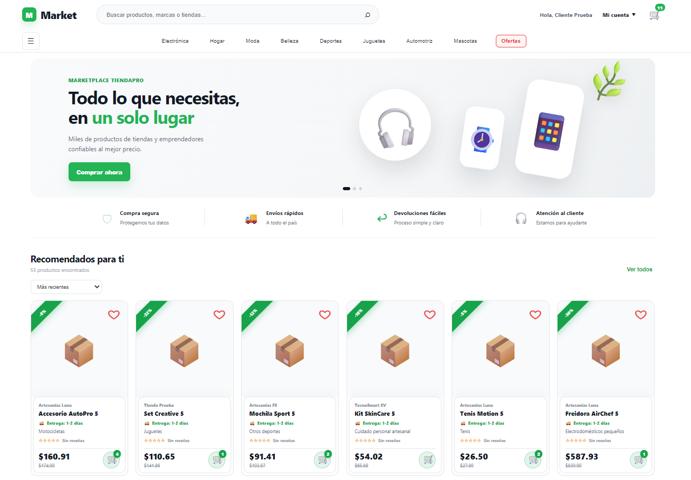
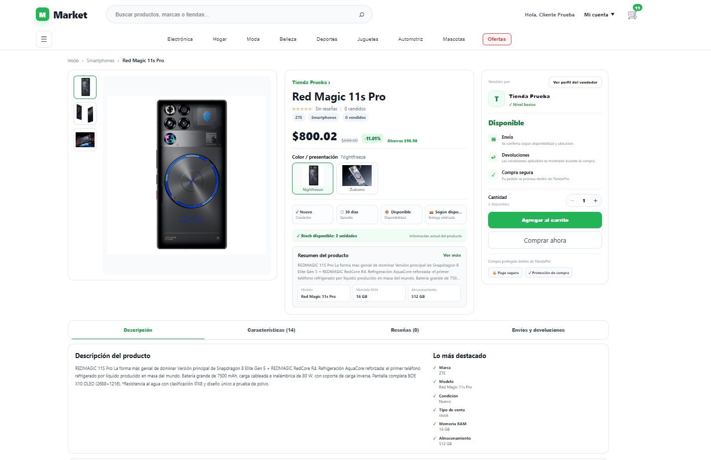
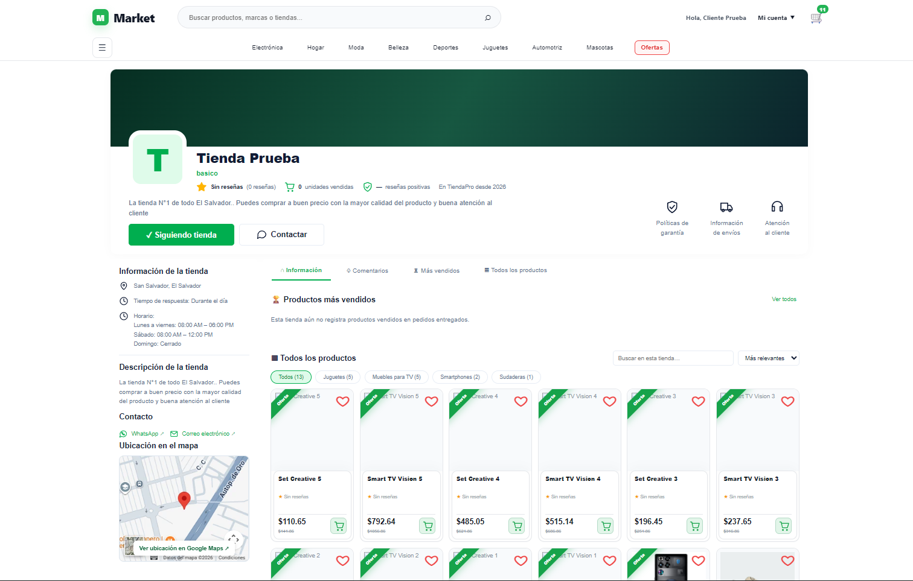
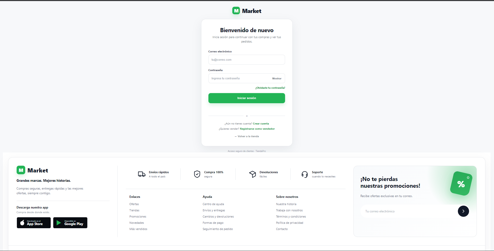
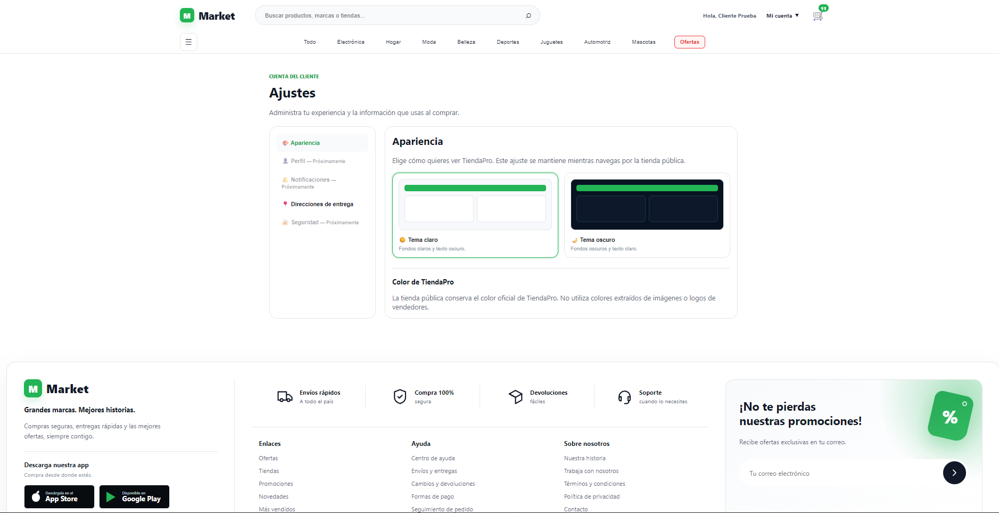

# TiendaPro Marketplace

Proyecto personal de aprendizaje creado para practicar desarrollo web y comprender el funcionamiento de una tienda en línea tipo marketplace.

> **Estado:** proyecto en desarrollo. Lo utilizo como práctica para continuar aprendiendo programación, bases de datos, pruebas y organización de una aplicación web.


## Tecnologías que estoy practicando

- HTML y CSS
- JavaScript
- Node.js
- Express
- MySQL
- JWT y bcrypt para prácticas de autenticación
- Git y GitHub
- Postman para probar endpoints

## Funciones incluidas en el proyecto

El proyecto contiene distintas áreas que he ido desarrollando y probando, entre ellas:

- Registro e inicio de sesión.
- Catálogo y visualización de productos.
- Carrito y flujo de pedidos.
- Panel de administración.
- Panel y catálogo para vendedores.
- Inventario y gestión de productos.
- Facturación y devoluciones.
- Analíticas y configuración de la tienda.

No todas las funciones están finalizadas y algunas continúan en proceso de mejora.

## Capturas del proyecto

Estas capturas muestran algunas pantallas del proyecto en su estado actual. Los textos visibles son datos de prueba usados durante el desarrollo.

### Inicio de la tienda



### Detalle de producto



### Perfil del vendedor



### Inicio de sesión



### Ajustes de apariencia



## Estructura general

```text
backend/     Servidor, rutas, autenticación y conexión con MySQL
frontend/    Páginas, estilos y JavaScript de la interfaz
screenshots/ Capturas usadas para documentar el proyecto
```

## Configuración local

### 1. Requisitos

- Node.js
- MySQL
- npm

### 2. Instalar dependencias del backend

```bash
cd backend
npm install
```

### 3. Variables de entorno

Copia `backend/.env.example` como `backend/.env` y configura los datos de tu base de datos local y un `JWT_SECRET` propio.

**El archivo `.env` no debe publicarse.**

### 4. Iniciar el backend

```bash
npm run dev
```

El servidor utiliza por defecto el puerto `3000`.

## Nota sobre la base de datos

Este repositorio para portafolio no incluye una base de datos con información real ni credenciales privadas. Para ejecutar todas las funciones es necesario disponer del esquema MySQL compatible con el proyecto.

## Objetivo del proyecto

TiendaPro no se presenta como un producto comercial terminado. Es un proyecto personal que utilizo para aplicar lo aprendido, detectar errores, realizar pruebas y familiarizarme con el desarrollo de aplicaciones web.
